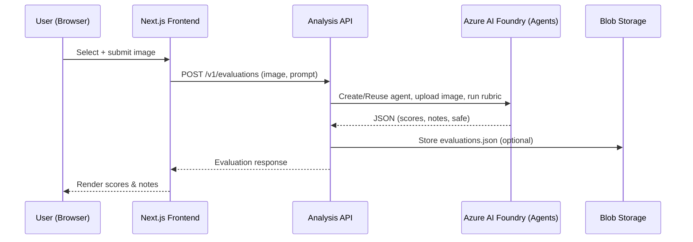
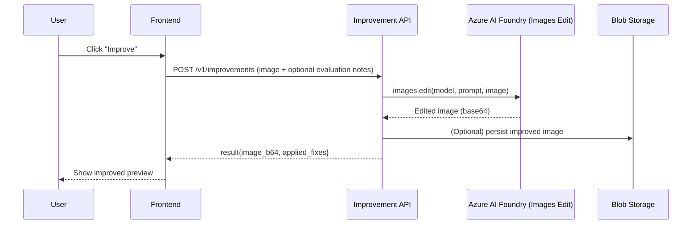
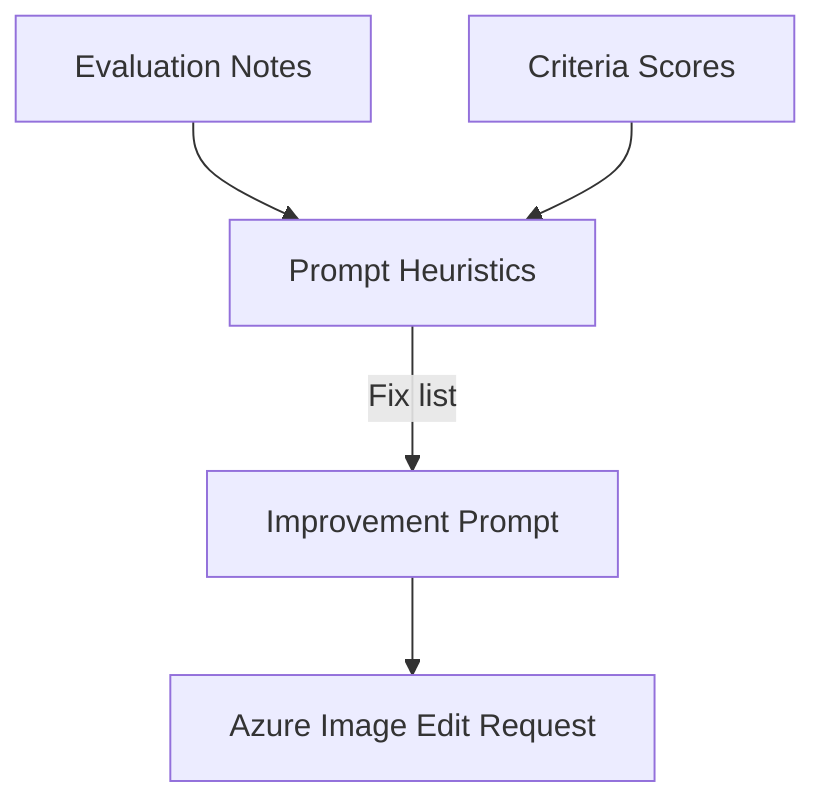
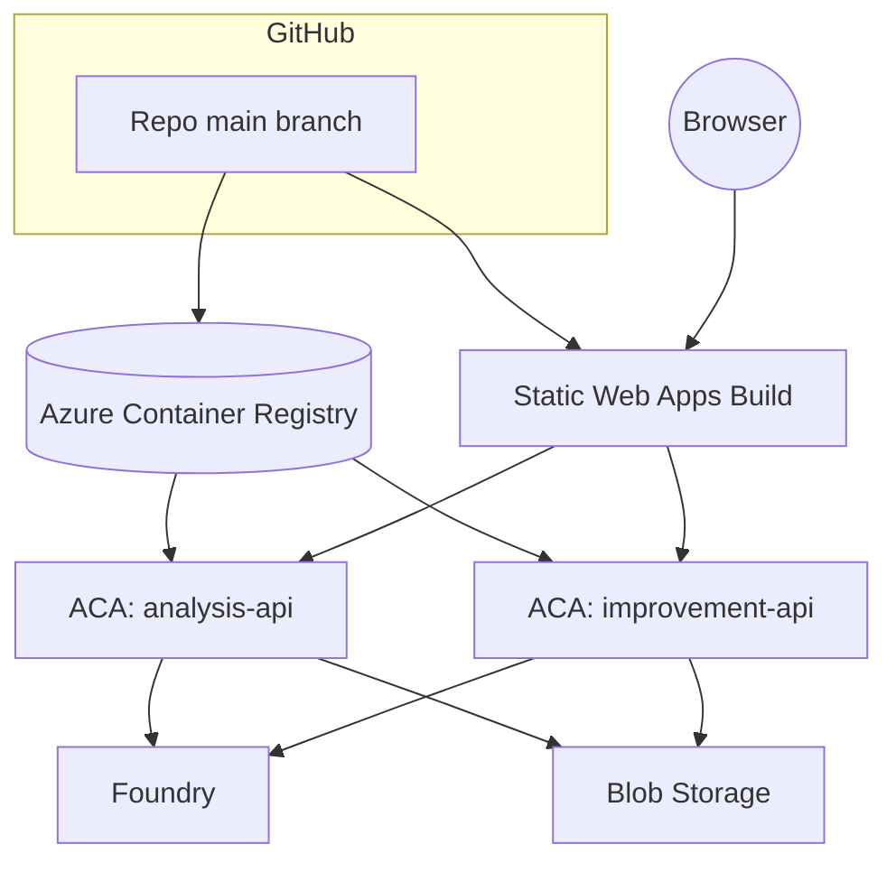
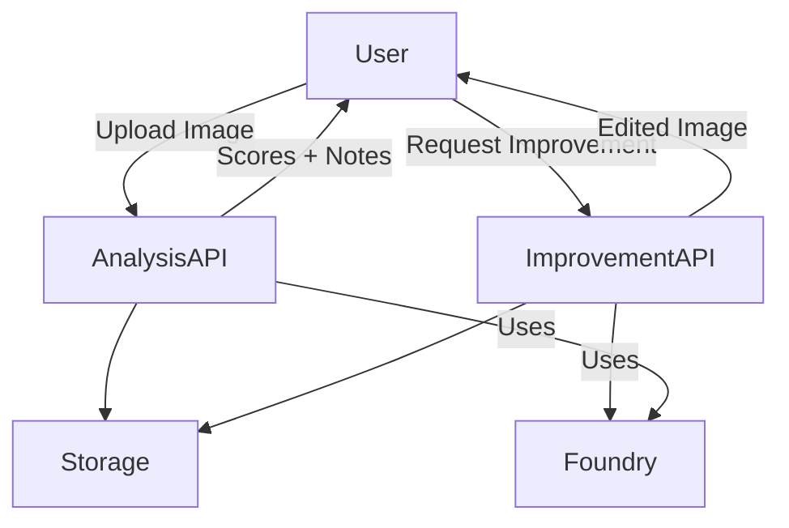

<!-- <div align="center"> -->

# Image Analysis & Improvement Platform

End‑to‑end sample that evaluates document‑style photos against a strict rubric and (optionally) auto‑improves them using Azure AI Foundry (Agents + Image Edits). Frontend (Next.js) + two FastAPI microservices (analysis & improvement) + Azure AI + Azure Storage.

</div>


## Repository Structure

```
├── README.md                 # (This file) root docs & architecture
├── src
│   ├── analysis/             # Evaluation (rubric scoring) service (FastAPI)
│   │   ├── main.py           # FastAPI app entrypoint
│   │   ├── analysis.py       # Core async evaluation logic (Azure Agents)
│   │   ├── schemas.py        # Pydantic models
│   │   ├── utils.py          # Helper / guard logic, file & image helpers
│   │   └── README.md         # Service‑specific docs
│   ├── improvement/          # Image enhancement service (FastAPI)
│   │   ├── main.py
│   │   ├── improvement.py    # High‑level improve_image orchestration
│   │   ├── utils.py          # Prompt derivation & image edit call
│   │   ├── schemas.py        # Pydantic models (returns base64 image)
│   │   └── README.md
│   └── interface/            # Next.js 15 frontend (App Router)
│       ├── app/upload/       # Main upload workflow UI
│       └── README.md         # Frontend generated scaffold docs
├── pyproject.toml            # Python dependencies (Poetry)
└── LICENSE.md / etc.
```

## High‑Level Architecture

```mermaid
graph LR
	User((User Browser)) --> SWA[Azure Static Web Apps (Next.js)]
	subgraph ACA[Azure Container Apps Environment]
		AAPI[(Analysis API)]
		IAPI[(Improvement API)]
	end
	SWA --> AAPI
	SWA --> IAPI
	AAPI --> Foundry[Azure AI Foundry Project]
	IAPI --> Foundry
	AAPI --> Storage[(Azure Blob Storage)]
	IAPI --> Storage
	SWA --> Storage
	Foundry --> Models[(Model Deployments: gpt-5-mini, gpt-image-1)]
```

### Core Components
| Component | Purpose | Tech |
|-----------|---------|------|
| Analysis Service | Scores an image via rubric using Azure AI Agents | FastAPI + azure-ai-projects + azure-ai-agents |
| Improvement Service | Applies minimal edits (background, crop, etc.) | FastAPI + azure-ai-projects + OpenAI Images Edit |
| Frontend | Upload UI, evaluation + improvement flow | Next.js (Static Web App) |
| Azure AI Foundry | Model deployments (text + image) | GPT family (e.g. `gpt-5-mini`, `gpt-image-1`) |
| Blob Storage | Persist original/evaluated/improved assets & JSON | Azure Storage (Blob) |

## Primary Flows

### 1. Evaluation Flow


### 2. Improvement Flow


### 3. Prompt Derivation (Improvement)


## Local Development

### Prerequisites
* Python 3.13
* Node 18+ (for Next.js)
* Poetry
* Azure CLI (`az`) for auth (`az login`)

### Environment Variables (root `.env` under `src/`)
| Variable | Purpose |
|----------|---------|
| `PROJECT_ENDPOINT` | Azure AI Foundry project endpoint URL |
| `MODEL_DEPLOYMENT_NAME` | Text / agent model deployment name (evaluation) |
| `IMAGE_DEPLOYMENT_NAME` | Image edit model deployment name (improvement) |
| `EVAL_PROMPT` | Optional default evaluation prompt override |

### Run Services
```bash
# (Windows PowerShell examples)
poetry install
poetry run uvicorn analysis.main:app --reload --host 0.0.0.0 --port 8000 --app-dir src
poetry run uvicorn improvement.main:app --reload --host 0.0.0.0 --port 8001 --app-dir src

cd src/interface
yarn install
yarn dev  # opens http://localhost:3000
```

## Suggested Azure Deployment (All Azure‑native)

| Need | Azure Service | Notes |
|------|---------------|-------|
| Frontend hosting & auth integration | Azure Static Web Apps | Connect to GitHub repo; build Next.js; inject API base URLs as env |
| Containerized APIs | Azure Container Apps (ACA) | Two apps: `analysis-api`, `improvement-api` in one ACA Environment |
| AI model serving | Azure AI Foundry Project | Deploy `gpt-5-mini` (agents) + `gpt-image-1` (image edits) |
| Artifact & asset storage | Azure Storage Account (Blob) | Containers: `original`, `evaluations`, `improved` |
| Secrets & configuration | (Optionally) Azure Key Vault | Store custom tokens / non-source-controlled secrets |
| Auth for services | Managed Identity (User-Assigned) | Attach to both Container Apps; grant Foundry + Storage RBAC roles |
| Monitoring & tracing | Azure Monitor + Container Apps Diagnostics + (optional) App Insights | Capture latency & error metrics |

### Deployment Topology (conceptual)


### Provision Outline (CLI Pseudosteps)
1. Create resource group & storage account (blob containers)  
2. Create Azure AI Foundry project + model deployments (`gpt-5-mini`, `gpt-image-1`)  
3. Create Container Apps Environment + Container Registry (or use ACR)  
4. Build & push container images for each FastAPI service  
5. Deploy `analysis-api` & `improvement-api` as Container Apps with managed identity & env vars (`PROJECT_ENDPOINT`, `MODEL_DEPLOYMENT_NAME`, `IMAGE_DEPLOYMENT_NAME`)  
6. Grant managed identity roles: `Cognitive Services User` (or appropriate) on the AI resource + `Storage Blob Data Contributor` on the storage account  
7. Deploy Static Web App pointing to `src/interface` with env settings for API base URLs  
8. Configure CORS allowed origins (SWA domain) on both APIs if restricting origins  
9. (Optional) Add Key Vault & reference secrets via Container Apps secret refs  
10. Enable diagnostics & alerts (error rate, latency).

### Scaling & Resilience
| Service | Min / Max Replicas | Autoscale Trigger Example |
|---------|--------------------|---------------------------|
| analysis-api | 1 / 5 | Average CPU > 60% OR RPS > X |
| improvement-api | 1 / 5 | Average CPU > 60% OR queue length (if added) |

### Security Considerations
* Enforce HTTPS only (default on SWA & Container Apps front door)
* Restrict AI Foundry access via RBAC + managed identity (avoid embedding keys)
* Validate MIME and size (already implemented) before calling AI models
* Consider virus scanning / content moderation (extend analysis service) for production
* Store evaluation/improvement artifacts with private access; generate SAS if user downloads.

## Testing Strategy
| Layer | Approach |
|-------|----------|
| Unit | Pydantic models, utility functions (prompt derivation, size validation) |
| Integration | Mock Azure AI with recorded responses or local test stubs |
| E2E | Cypress / Playwright hitting deployed SWA + staging APIs |

## Contributing
1. Fork & branch: `feat/<short-name>`  
2. Add / update tests  
3. Run linters & format (`black`, `isort`, `pylint`)  
4. Open PR; include diagrams if altering flows.  

## License
See `LICENSE.md`.

## Additional Diagrams (Use Case Summary)


---
For detailed internal logic see the service READMEs under `src/analysis` and `src/improvement`.
