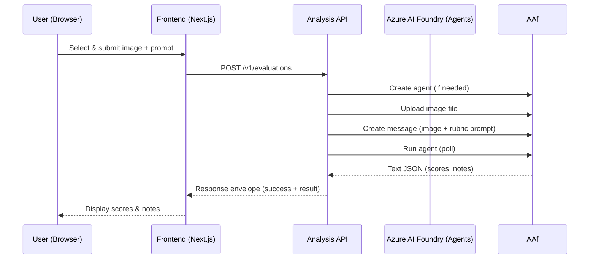
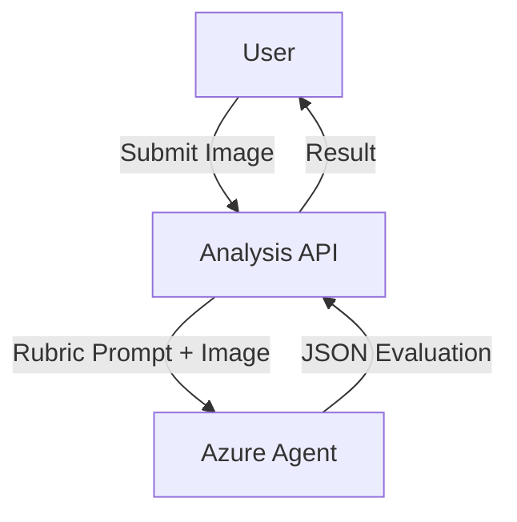

# Analysis Service (Image Evaluation)

Evaluates a document-style photo using an Azure AI Agents (Foundry) model and returns a structured rubric result: overall score, per‑criteria scores, safety flag, and Spanish notes.

## Responsibilities
- Accept multipart image + prompt (or default rubric prompt).
- Create/reuse an agent with deterministic instructions (rubric in Spanish).
- Upload image as assistant file.
- Run the agent and parse strict JSON response.
- Return `ImageEvaluationResponse` envelope.
- (Optional) Persist `evaluations.json` locally for batch CLI runs.

## Key Modules
| File | Purpose |
|------|---------|
| `analysis.py` | Core async evaluation logic & agent orchestration. |
| `main.py` | FastAPI app exposing `/v1/evaluations` and health endpoint. |
| `schemas.py` | Pydantic request/response models. |
| `utils.py` | Helper utilities (file type checks, image heuristics, safe guards). |
| `api_models.py` | Shared API error/health models. |

## Sequence (Evaluation Flow)


## Use Case Diagram


## Environment Variables
| Variable | Usage |
|----------|-------|
| `PROJECT_ENDPOINT` | Azure AI Foundry project endpoint |
| `MODEL_DEPLOYMENT_NAME` | Agents model deployment name (e.g. `gpt-5-mini`) |
| `EVAL_PROMPT` | Default prompt override (optional) |
| `AGENT_ID` | Reuse an existing agent (optional) |
| `AGENT_NAME` | Name when creating a new agent |

## API Contract (Simplified)
Request: `multipart/form-data` fields: `image` (binary), `prompt` (string – optional).  
Response (200):
```json
{
  "success": true,
  "result": {
    "overall_score": 85,
    "criteria_scores": {"fondo_blanco": 25, ...},
    "safe": true,
    "notes": "La foto cumple...",
    "agent_id": "agt_...",
    "thread_id": "thr_..."
  }
}
```

## Error Handling
- Returns `success=false` with `error` message OR HTTP error envelope (400/502) via shared `ErrorResponse`.
- Defensive JSON parse: if agent deviates, returns invalid JSON error.

## Extensibility Ideas
| Idea | Description |
|------|-------------|
| Add rate limiting | Protect service from abuse. |
| Background queue | Offload long-running evaluations. |
| Additional criteria | Extend rubric + model instructions. |
| Persistence layer | Store results in Cosmos DB / Table. |

## Local CLI Batch
Run `python -m analysis.analysis --assets-dir <dir>` to evaluate all images in a folder; outputs `evaluations.json`.

## Security Notes
- Utilizes `DefaultAzureCredential`; recommend Managed Identity in Azure.
- Validate file type & size (extend `utils.py` if adding formats).

## Testing Targets
- JSON parsing robustness.
- Criteria score normalization.
- Error envelopes (400 invalid prompt / missing image).