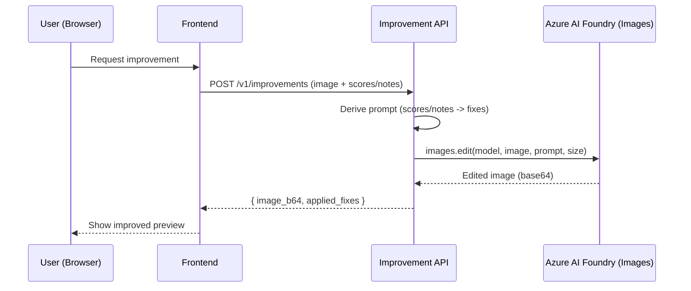
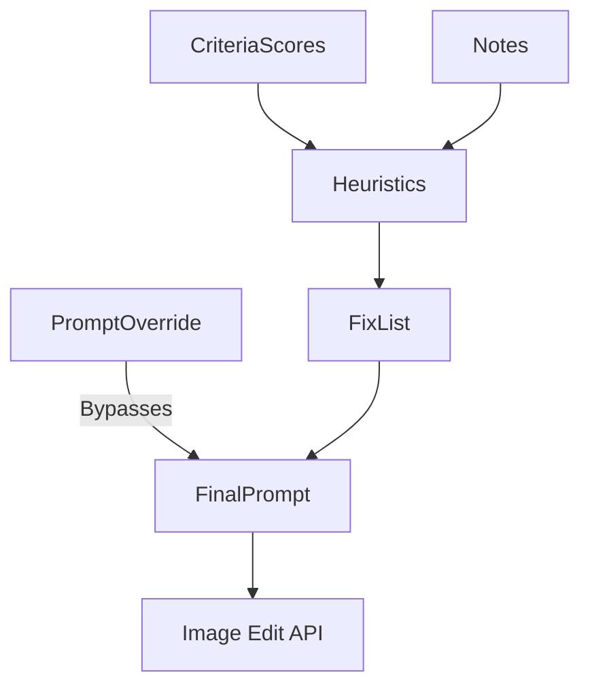

# Improvement Service (Image Enhancement)

Transforms a document-style photo to comply with the evaluation rubric (crop to 3:4, uniform white background, frontal face, remove obstructions, etc.) using Azure AI Foundry image edits. Produces a minimally changed, compliant image plus a list of applied fixes.

## Responsibilities

- Accept multipart image (and optionally notes + criteria scores).
- Derive an edit prompt (heuristics from scores/notes or explicit override).
- Call Azure AI Image Edit deployment with that prompt.
- Return base64 image + list of applied fix directives.
- Provide batch CLI to process previous `evaluations.json` outputs.

## Key Modules

| File | Purpose |
|------|---------|
| `improvement.py` | Async `improve_image` orchestration + CLI batch logic. |
| `utils.py` | Prompt derivation, heuristic fixes, image edit call, temporary file mgmt. |
| `schemas.py` | Job / result / response Pydantic models (image returned as `image_b64`). |
| `main.py` | FastAPI app exposing `/v1/improvements`. |

## Sequence (Improvement Flow)



## Prompt Derivation Logic



1. If `prompt_override` provided -> use directly.
2. Else if `notes` exist -> (optionally) agent planning (currently heuristic first).
3. Else build fixes from low rubric scores; fallback to a generic minimal-improvement instruction.

## Environment Variables

| Variable | Usage |
|----------|-------|
| `PROJECT_ENDPOINT` | Azure AI Foundry project endpoint |
| `IMAGE_DEPLOYMENT_NAME` | Image edit model deployment name (e.g. `gpt-image-1`) |
| `MODEL_DEPLOYMENT_NAME` | (Optional) agent planning model if used |
| `IMPROVEMENT_AUTH_TOKEN` | Optional bearer token for internal auth (not required) |

## API Contract (Simplified)

Request: multipart fields: `image` (file), optional `notes`, `criteria_scores` (JSON), `size`, `prompt_override`.

Response (200):
```json
{
  "success": true,
  "result": {
    "filename": "photo.jpg",
    "content_type": "image/jpeg",
    "image_b64": "<base64>",
    "prompt": "Edita la imagen...",
    "applied_fixes": ["Uniformizar fondo", "Ajustar recorte 3:4"]
  }
}
```

## Error Handling

- Returns 400 for invalid size / criteria_scores JSON.
- Returns 413 for images above size limit.
- Returns 502 if image edit model did not return usable output.
- All errors include an `ErrorResponse` envelope with action guidance.

## Performance Considerations

| Concern | Mitigation |
|---------|------------|
| Large images | Enforced MB limit + (future) optional server-side downscale. |
| Cold starts | Container Apps min replica = 1. |
| Prompt variability | Deterministic fix list heuristics. |

## Extensibility Ideas

| Feature | Description |
|---------|-------------|
| Batch storage | Automatically store improved images in blob storage with metadata. |
| Multiple sizes | Generate thumbnails (256) & full (1024). |
| Diff overlay | Return change mask to highlight edits. |
| Audit log | Persist applied fixes & prompts for compliance. |

## Security Notes

- Uses `DefaultAzureCredential`; deploy with Managed Identity & restrict outbound if possible.
- Consider scanning edited images before distribution in regulated environments.

## Testing Targets

- Prompt derivation correctness (score thresholds -> expected fixes).
- Base64 encoding / decoding round trip.
- Error pathways (missing env vars, invalid JSON, size limit).